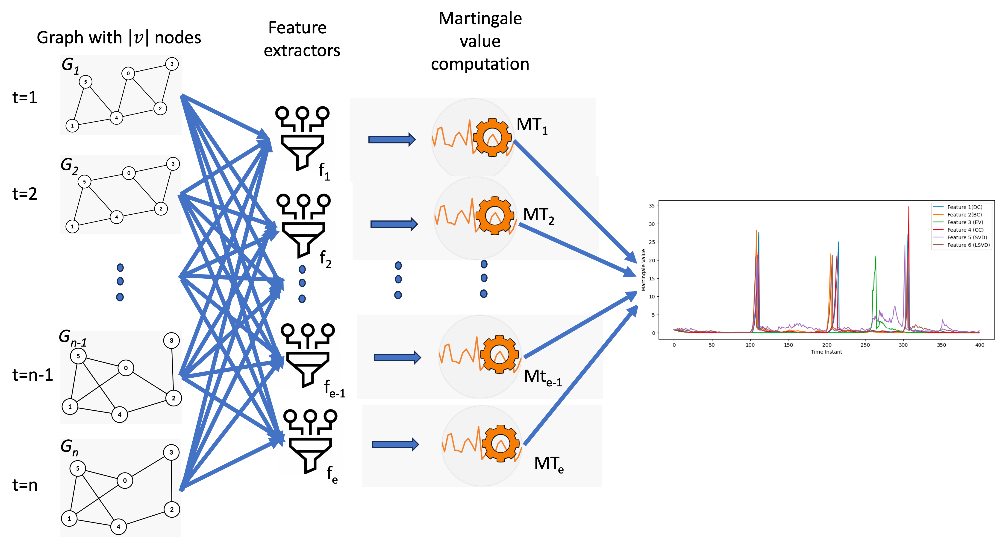
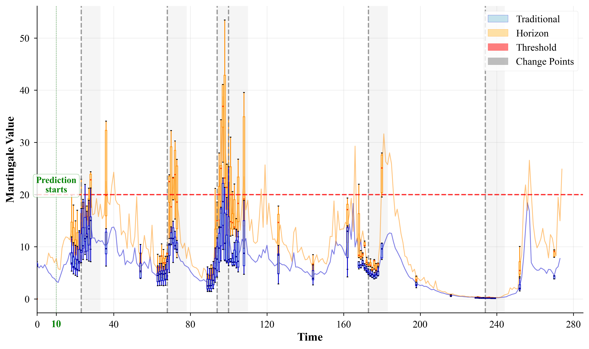
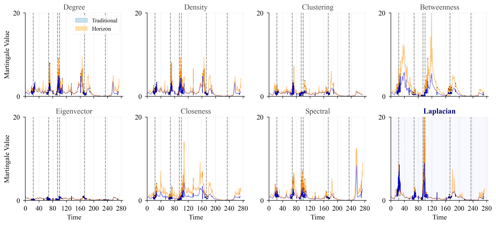
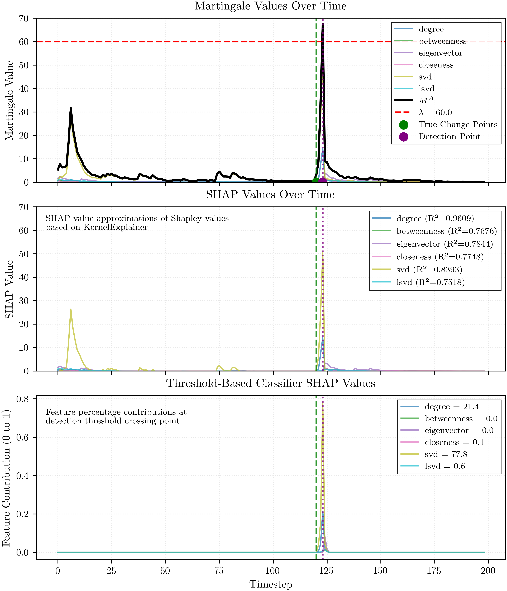
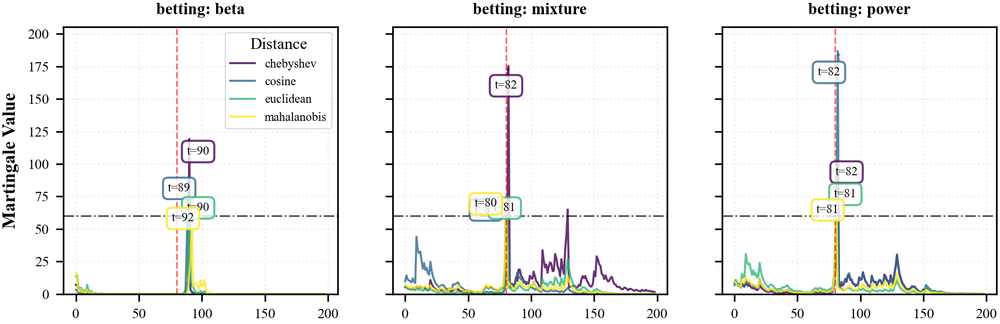
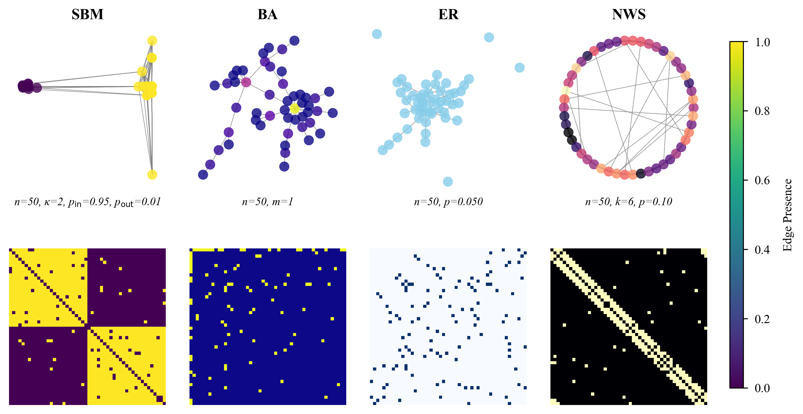
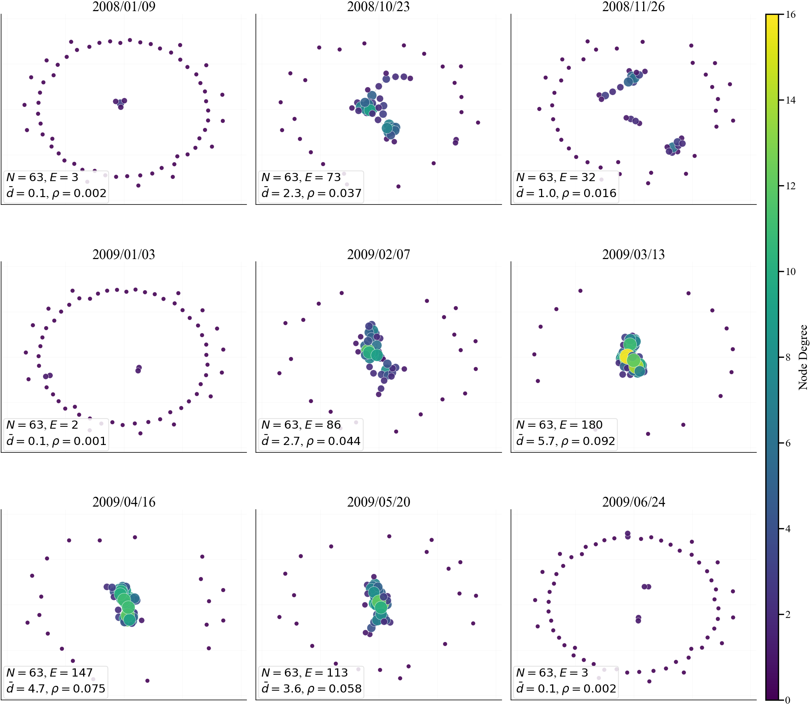

# Change Point Detection in Dynamic Networks

A robust framework for detecting and explaining significant structural changes in dynamic networks using martingale-based methods with explainable AI integration.

[](https://doi.org/10.5281/zenodo.15420100)

## Overview

This project implements a comprehensive pipeline for detecting changes in the underlying structure of evolving networks. The approach leverages martingale-based sequential analysis to detect anomalies in network structure features.

Key features:
- Multiple graph models (SBM, Barabási-Albert, Watts-Strogatz, Erdős-Rényi)
- Advanced martingale-based detection with various betting functions
- Explainable AI using SHAP (SHapley Additive exPlanations) for result interpretation
- Comprehensive visualization suite for analysis and result presentation



## Installation

```bash
git clone https://github.com/your-repo/martingale_structural_change_detection.git
cd martingale_structural_change_detection
pip install -r requirements.txt
```

## Module Structure

- `src/algorithm.py`: Core pipeline for graph change point detection
- `src/changepoint/`: Martingale-based detection algorithms
- `src/graph/`: Graph generation, feature extraction, and utilities
- `src/configs/`: Configuration files for different detection scenarios
- `src/utils/`: Visualization, analysis, and helper functions

## Usage

### Basic Usage

```bash
python src/run.py -c src/configs/algorithm.yaml
```

CLI for overriding configuration parameters:

```bash
python src/run.py -c src/configs/algorithm.yaml [OPTIONS]
```

#### Available Options

| Option | Description |
|--------|-------------|
| `-c, --config` | Path to configuration file (required) |
| `-ll, --log-level` | Logging level (DEBUG/INFO/WARNING/ERROR/CRITICAL) |
| `-n, --n-trials` | Number of detection trials to run |
| `-l, --threshold` | Detection threshold value |
| `-d, --distance` | Distance measure (euclidean/mahalanobis/manhattan/minkowski/cosine) |
| `-net, --network` | Network type (sbm/ba/ws/er) |
| `-bf, --betting-func` | Betting function (power/exponential/mixture/constant/beta/kernel) |

Run with 5 trials on a Barabási-Albert network:
```bash
python src/run.py -c src/configs/algorithm.yaml -n 5 -net ba
```

Lower detection threshold and use Euclidean distance:
```bash
python src/run.py -c src/configs/algorithm.yaml -l 40 -d euclidean
```

## Workflow and Results

### Example Run

Here's a typical workflow when running the detection pipeline:

```
python .\src\run.py -c .\src\configs\algorithm.yaml
2025-05-14 16:24:54 - __main__ - INFO - Using configuration file: .\src\configs\algorithm.yaml
2025-05-14 16:24:54 - src.algorithm - INFO - STEP 1: Setting up output directory
2025-05-14 16:24:54 - src.algorithm - INFO - STEP 2: Generating graph sequence
2025-05-14 16:24:54 - src.graph.generator - INFO - Initialized generator for sbm model
2025-05-14 16:24:54 - src.graph.generator - INFO - Generated 2 change points at: [80, 160]
2025-05-14 16:24:54 - src.algorithm - INFO - Generated sequence with 200 graphs and 2 change points at: [80, 160]
2025-05-14 16:24:54 - src.algorithm - INFO - STEP 3: Extracting features
2025-05-14 16:24:59 - src.algorithm - INFO - Extracted 8 features across 200 timesteps
2025-05-14 16:24:59 - src.algorithm - INFO - STEP 4: Normalizing features
2025-05-14 16:24:59 - src.algorithm - INFO - STEP 5: Running detection trials
2025-05-14 16:24:59 - src.algorithm - INFO - Running 1 detection trials with varying algorithm seeds
2025-05-14 16:24:59 - src.algorithm - INFO - Running trial 1/1 with seed 1608637542
2025-05-14 16:25:05 - src.algorithm - INFO - Completed 1/1 trials successfully
2025-05-14 16:25:05 - src.algorithm - INFO - STEP 7: Exporting results to CSV
2025-05-14 16:25:05 - src.utils.output_manager - INFO - Results saved to results\sbm_mahalanobis_mixture_20250514_162454\detection_results.xlsx
2025-05-14 16:25:05 - src.algorithm - INFO - STEP 8: Preparing result data
2025-05-14 16:25:05 - src.algorithm - INFO - Pipeline execution completed successfully
```

### Detection Results

The framework produces detailed detection metrics showing the performance:

```
Change Point Detection Analysis
==============================

Detection Details:
╭───────────┬─────────────────────────┬─────────────────╮
│   True CP │   Traditional Detection │   Delay (steps) │
├───────────┼─────────────────────────┼─────────────────┤
│        80 │                      88 │               8 │
├───────────┼─────────────────────────┼─────────────────┤
│       160 │                     164 │               4 │
╰───────────┴─────────────────────────┴─────────────────╯

Summary Statistics:
╭────────────────┬───────────────╮
│ Metric         │ Traditional   │
├────────────────┼───────────────┤
│ Detection Rate │ 100.00%       │
├────────────────┼───────────────┤
│ Average Delay  │ 6.00          │
╰────────────────┴───────────────╯
```

### Visualization Tools

After running detection, you can generate detailed visualizations with the provided utilities:

```bash
# Generate martingale plots
python src/utils/plot_martingale.py -f ./results/your_results_folder/detection_results.xlsx

# Generate SHAP analysis plots
python src/utils/plot_shap.py -f ./results/your_results_folder/detection_results.xlsx
```

## Example Visualizations

### Martingale Tracking

The sum martingale plot shows how the martingale increases when change points occur. Vertical dashed lines indicate true change points, while markers show where the algorithm detected the changes.



### Individual Feature Martingales

The individual feature martingales demonstrate which network features contribute most to change detection:



### Feature Importance Analysis with SHAP

SHAP values provide explainable insights into how each network feature contributes to change detection:



### Different Betting Functions

Martingale performance varies based on the betting function used:



### Network Visualization

Synthetic networks used for benchmarking:



### Real-World Applications

MIT Reality Mining dataset analysis, showing evolving social network structure:



## Algorithm Overview

The detection pipeline consists of several key components:

1. **Graph Sequence Generation**: Creates a sequence of evolving graphs with predefined change points
2. **Feature Extraction**: Extracts topological features from each graph in the sequence
3. **Change Point Detection**: Applies martingale-based detection methods
4. **Visualization & Analysis**: Generates research-quality visualizations and numerical analysis

## Data Sources

- [Synthetic Graph Data](src/config/synthetic_data_config.yaml)
- [MIT Reality Mining Dataset](https://realitycommons.media.mit.edu/realitymining.html)

## Repository and Archive

This project is officially archived and accessible through:

- **GitHub Repository**: [martingale_structural_change_detection](https://github.com/ali-izhar/martingale_structural_change_detection)
- **Zenodo Archive**: [](https://doi.org/10.5281/zenodo.15420100)

## Citation

If you use this code or method in your research, please cite our paper:

```bibtex
@article{Ho2025MartingaleStructural,
  title = {Detecting and Explaining Structural Changes in an Evolving Graph using a Martingale},
  author = {Ho, Shen-Shyang and Kairamkonda, Tarun Teja and Ali, Izhar},
  journal = {Pattern Recognition},
  year = {2025},
  doi = {10.5281/zenodo.15420100},
  publisher = {Elsevier}
}
```

## References

1. Ho, S. S., et al. (2005). "A martingale framework for concept change detection in time-varying data streams." 
ICML.
2. Ho, S. S., Kairamkonda, T. T., & Ali, I. (2024). Change point detection in evolving graph using martingale. In Proceedings of the 39th ACM/SIGAPP Symposium on Applied Computing (pp. 466-473).
3. Lundberg, S. M., & Lee, S. I. (2017). "A unified approach to interpreting model predictions." NeurIPS.
4. Newman, M. E. J. (2010). "Networks: An Introduction." Oxford University Press.

## Contributing

We welcome contributions to improve the project. Please see our [CONTRIBUTING.md](CONTRIBUTING.md) for guidelines.

## License

This project is licensed under the MIT License - see the [LICENSE](LICENSE) file for details.