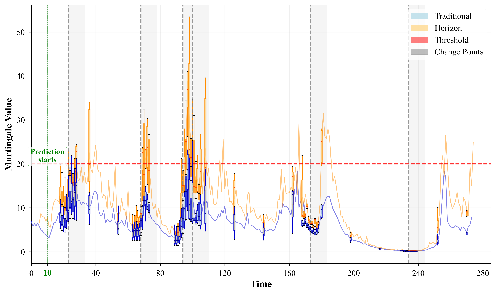

This repository is no longer maintained

> **Archived.** This repo accompanies the published Pattern Recognition paper
> and is preserved as the canonical source for reproducing that paper's
> results. Active development has moved to
>
> **[ali-izhar/anomaly_detection](https://github.com/ali-izhar/anomaly_detection)**
>
> which contains a clean reimplementation plus the Horizon
> Martingale extension from Ali & Ho (ICDM 2025). For any new work, please use that repo.

# Change Point Detection in Dynamic Networks

Martingale-based change detection on evolving graphs, with Shapley/SHAP
attribution of each graph feature's contribution to a detected change.

[](https://doi.org/10.5281/zenodo.15420100)
[](https://www.sciencedirect.com/science/article/pii/S0031320325005151)
[](https://doi.org/10.1016/j.patcog.2025.111855)

**Paper:** Ho, S.-S., Kairamkonda, T. T., & Ali, I. (2026). *Detecting and
explaining structural changes in an evolving graph using a martingale.*
Pattern Recognition, 169, 111855.



## Reproduce

```bash
git clone https://github.com/ali-izhar/martingale_structural_change_detection.git
cd martingale_structural_change_detection
python -m venv venv && source venv/bin/activate   # NumPy must be < 2.0
pip install -r requirements.txt
python src/run.py -c src/configs/algorithm.yaml
```

This generates a graph sequence, runs the multiview martingale detector, and
writes results to `results/<network>_<distance>_<betting>_<timestamp>/detection_results.xlsx`
(sheets `Trial1`, `Detection Summary`, `Detection Details`). A detection report
is printed to the console.

**Determinism.** Runs are reproducible: `model.seed` in
`src/configs/algorithm.yaml` (default `42`) seeds graph generation, and
`trials.random_seeds` seeds the detector, so repeated runs are bit-for-bit
identical. Set `model.seed: null` (or pass `-s <int>`) for a fresh random
sequence each run.

Override defaults with `-n <trials>`, `-net {sbm,ba,ws,er}`,
`-bf {power,exponential,mixture,beta,...}`, `-l <threshold>`,
`-d {euclidean,mahalanobis,cosine,...}`, `-s <seed>`.

**Figures.** Plotting is a separate step that reads the produced workbook:

```bash
python src/utils/plot_martingale.py -f results/<run>/detection_results.xlsx -o results/<run> -t 60
python src/utils/plot_shap.py        -f results/<run>/detection_results.xlsx -o results/<run> -t 60
```

`plot_shap.py` reports per-feature SHAP attributions (signed Linear-SHAP values
φ_j = M_j − E[M_j]) alongside the normalized martingale share at each detection.

## Citation

```bibtex
@article{Ho2026MartingaleStructural,
  title   = {Detecting and Explaining Structural Changes in an Evolving Graph using a Martingale},
  author  = {Ho, Shen-Shyang and Kairamkonda, Tarun Teja and Ali, Izhar},
  journal = {Pattern Recognition},
  year    = {2026},
  volume  = {169},
  pages   = {111855},
  doi     = {10.1016/j.patcog.2025.111855},
  url     = {https://www.sciencedirect.com/science/article/pii/S0031320325005151}
}
```

## License

MIT
